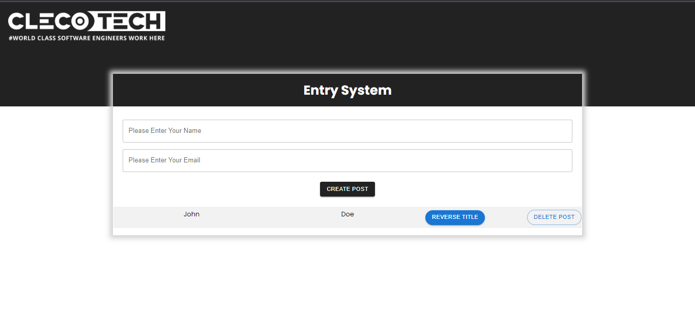

# Jest and Enzyme Testing

This project is for React Testing using Jest and Enzyme.


# Quick Start

```
npm install
npm start
```

The above commands will install dependencies and start the app. To run tests, run `npm test` on a separate command line.

## Testing libraries

This instance of create-react-app has been enhanced with the following testing libraries:

| Library                 | Description                                                                        |
| ----------------------- | ---------------------------------------------------------------------------------- |
| Jest                    | Automated testing                                                                  |
| Enzyme                  | Unit test React components in isolation via `shallow` or with children via `mount` |
| enzyme-adapter-react-16 | Configures enzyme to work with React 16                                            |
| enzyme-to-json          | Convert Enzyme wrappers to a format compatible with Jest snapshot testing.         |
